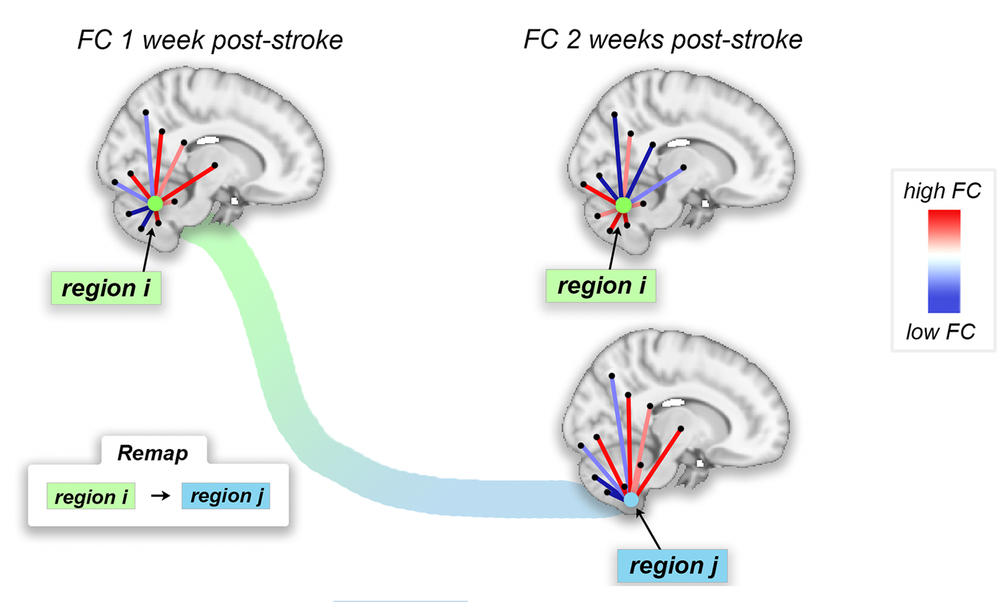

### Functional reorganization is related to motor recovery and structural disruption

This repository contains code to replicate analyses from the paper "Functional reorganization is related to motor recovery and structural disruption" by Olafson and colleagues.

1. Extract precision matrices from timeseries data (set diagonals to 0 prior to graph matching)
2. Run graph matching algorithm on precision matrices
3. Calculate remapping frequencies
4. Perform analyses 

Optional: estimate structural disconnection using the [NeMo tool v2.0](https://kuceyeski-wcm-web.s3.us-east-1.amazonaws.com/upload.html)
