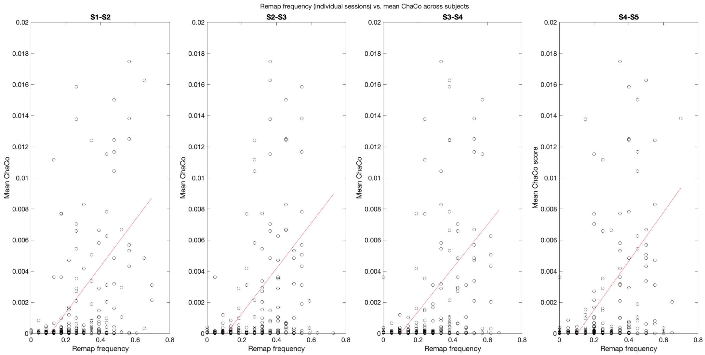
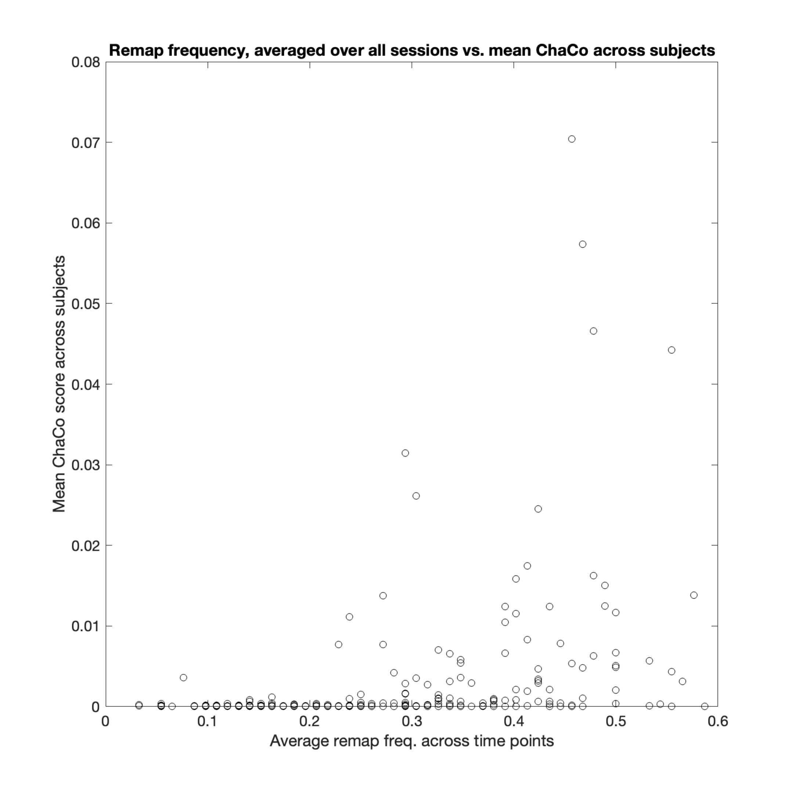
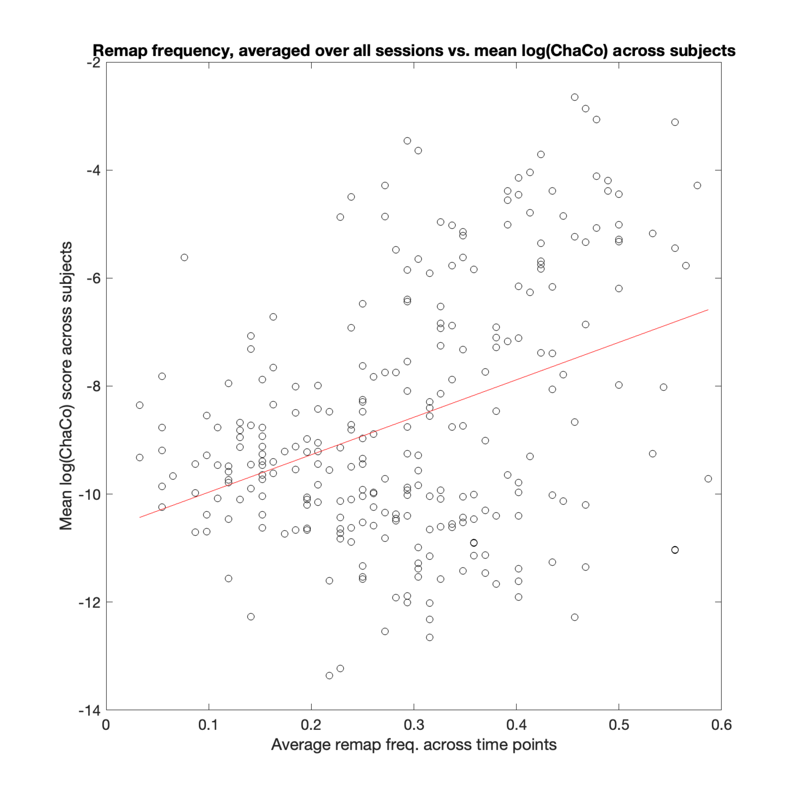
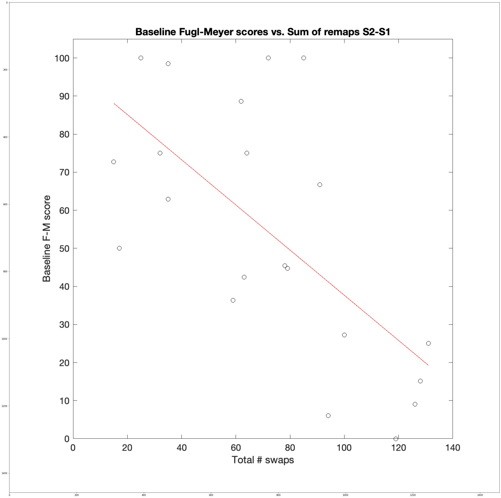
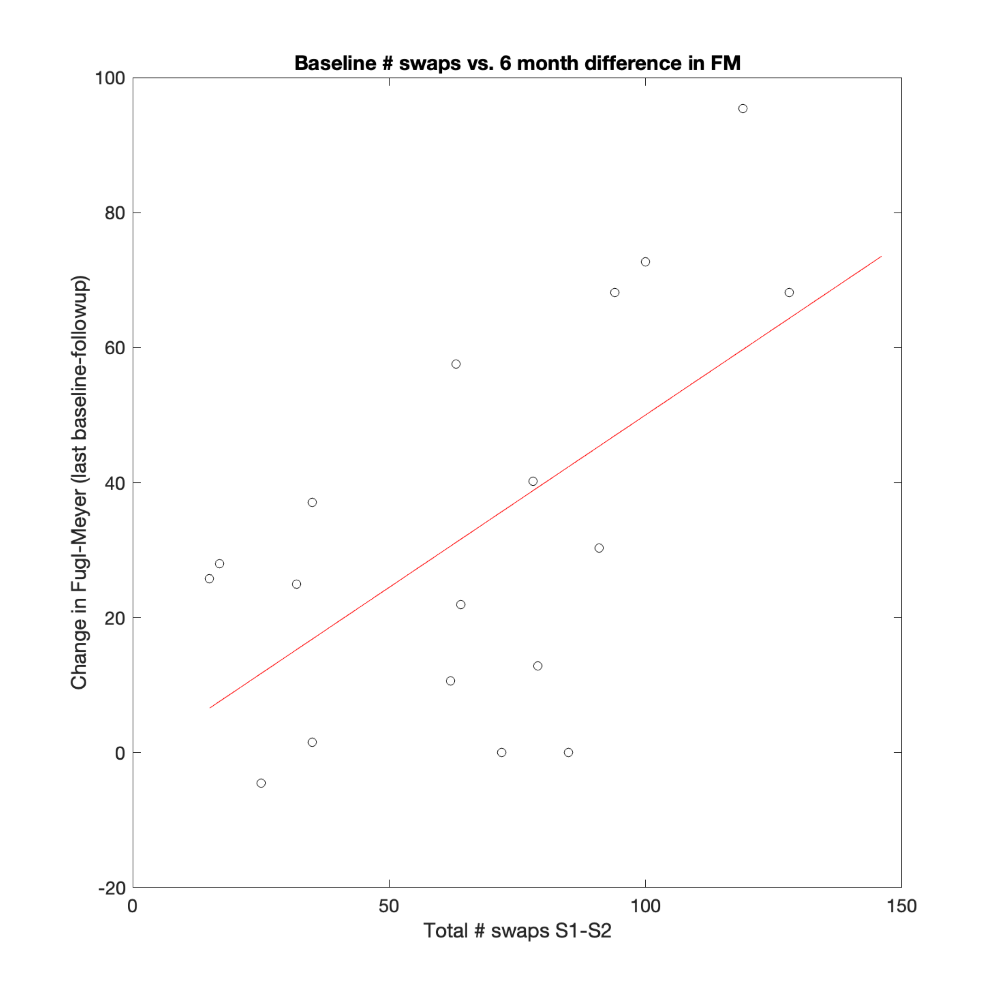
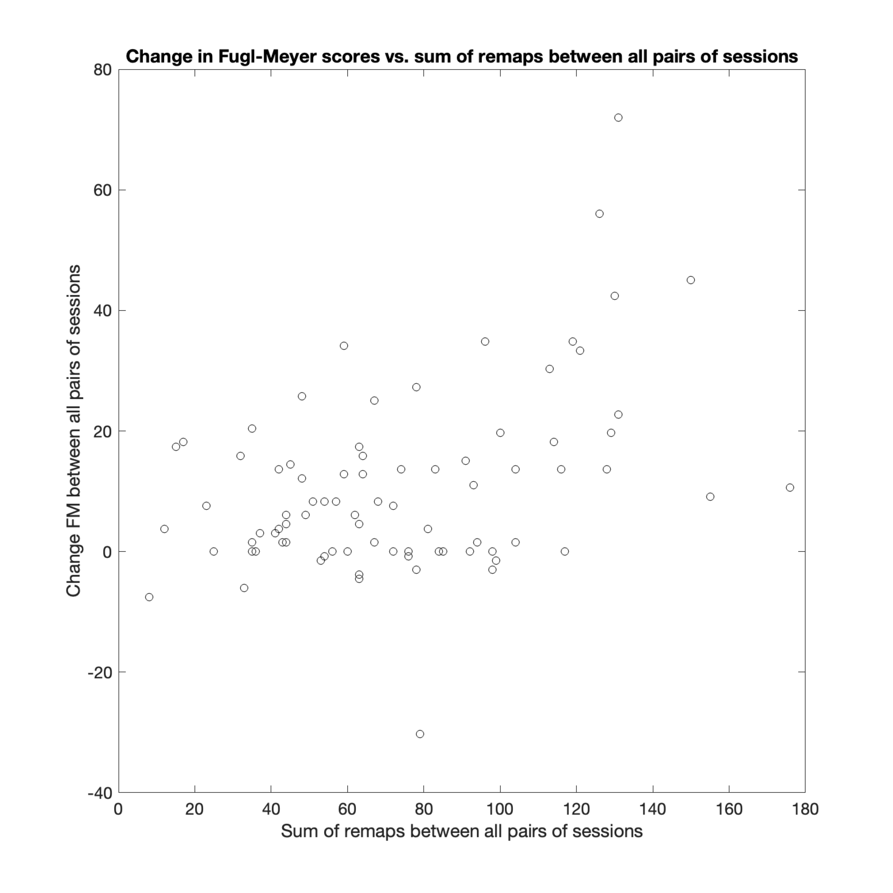
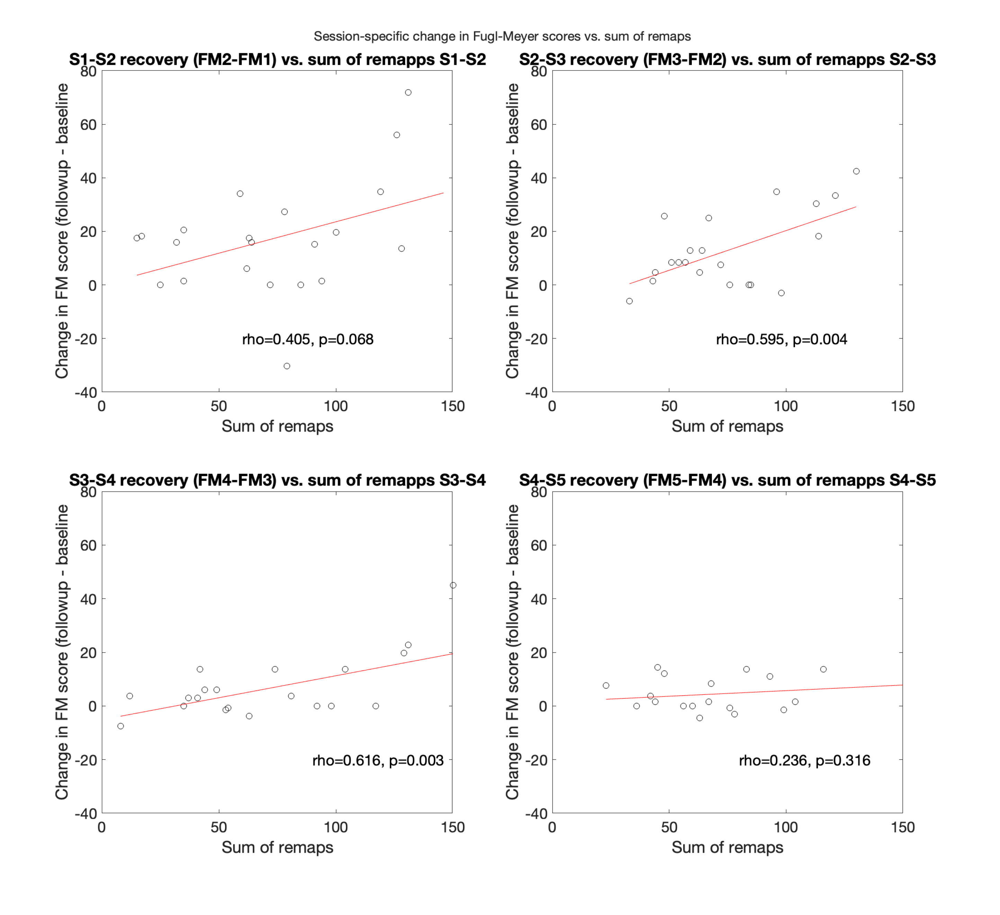

## Graph matching results with precision matrices
### alpha = 0.0


```python
import numpy as np
import os
from PIL import Image
import scipy.io as sio
import matplotlib.image as mpimg
from matplotlib import pyplot as plt
from matplotlib.gridspec import GridSpec
import dataframe_image as dfi
from IPython.display import display 
import pandas as pd

cwd = os.getcwd()
```


```python
# alphas 0, 1, 2, 3 correspond to: alpha paramter = 0, 0.0025, 0.0075, 0.0125 respectively
alpha = 0

results_dir = str(cwd) + '/results/jupyter/precision/stroke/alpha' + str(alpha) +'/'
figures_dir = results_dir + 'figures/'

# make results table.
results_dir = str(cwd) + '/results/jupyter/precision/stroke/alpha' + str(alpha)
results=loadmat(results_dir  + '/results.mat')
results=results['results']
```


```python
def color_negative_red(val): 
    """ 
    Takes a scalar and returns a string with 
    the css property `'color: red'` for negative 
    strings, black otherwise. 
    """
    color = 'red' if (val < 0.05 and val > 0) else 'black'
    return 'color: % s' % color 
```


```python
import scipy.io as spio

def loadmat(filename):
    '''
    this function should be called instead of direct spio.loadmat
    as it cures the problem of not properly recovering python dictionaries
    from mat files. It calls the function check keys to cure all entries
    which are still mat-objects
    '''
    data = spio.loadmat(filename, struct_as_record=False, squeeze_me=True)
    return _check_keys(data)

def _check_keys(dict):
    '''
    checks if entries in dictionary are mat-objects. If yes
    todict is called to change them to nested dictionaries
    '''
    for key in dict:
        if isinstance(dict[key], spio.matlab.mio5_params.mat_struct):
            dict[key] = _todict(dict[key])
    return dict        

def _todict(matobj):
    '''
    A recursive function which constructs from matobjects nested dictionaries
    '''
    dict = {}
    for strg in matobj._fieldnames:
        elem = matobj.__dict__[strg]
        if isinstance(elem, spio.matlab.mio5_params.mat_struct):
            dict[strg] = _todict(elem)
        else:
            dict[strg] = elem
    return dict
```

### Analysis 0
Remapping patterns across all subjects and time points:
   - Subjects listed vertically, brain regions listed horizontally (left - right)
   - Purple ticks indicate the node was mapped to itself
   - Yellow ticks indicate that the node was mapped to a different node (i.e. remapped)
   - Turquoise blocks indicate no data for that subject 


```python
img1 = mpimg.imread(str(figures_dir+'remapping_raster_allsubjects_overtime.png'))
fig = plt.figure(constrained_layout=True,figsize=(30,30))
ax1 = fig.add_subplot(1,1,1)

ax1.imshow(img1)
ax1.axis('off')
```


    (-0.5, 2916.5, 1457.5, -0.5)


    

    


### Analysis 1

Correlation between each brain region's remap frequency and mean ChaCo scores across subjects


```python
# Analysis 1 
a1=results['corr_w_chaco']
a1s1=a1['s1s2']
a1s2=a1['s2s3']
a1s3=a1['s3s4']
a1s4=a1['s4s5']


dict = {'Stat' : ['Pearson p', 'Pearson rho'],
        'S1-S2' : [a1s1['p'], a1s1['rho']] ,
        'S2-S3' : [a1s2['p'], a1s2['rho']] ,
        'S3-S4' : [a1s3['p'], a1s3['rho']] , 
        'S4-S5' : [a1s4['p'], a1s4['rho']]}

df = pd.DataFrame(dict) 
df=df.set_index('Stat')
df=df.style.applymap(color_negative_red).set_caption("Analysis 1")
display(df)

img2 = mpimg.imread(str(figures_dir+'corr_remapping_chaco.png'))
fig = plt.figure(constrained_layout=True,figsize=(30,30))
ax1 = fig.add_subplot(1,1,1)
ax1.imshow(img2)
ax1.axis('off')
```


<style  type="text/css" >
#T_867a3008_51dd_11eb_878a_1e00d22ee071row0_col0,#T_867a3008_51dd_11eb_878a_1e00d22ee071row0_col1,#T_867a3008_51dd_11eb_878a_1e00d22ee071row0_col2,#T_867a3008_51dd_11eb_878a_1e00d22ee071row0_col3{
            color:  red;
        }#T_867a3008_51dd_11eb_878a_1e00d22ee071row1_col0,#T_867a3008_51dd_11eb_878a_1e00d22ee071row1_col1,#T_867a3008_51dd_11eb_878a_1e00d22ee071row1_col2,#T_867a3008_51dd_11eb_878a_1e00d22ee071row1_col3{
            color:  black;
        }</style><table id="T_867a3008_51dd_11eb_878a_1e00d22ee071" ><caption>Analysis 1</caption><thead>    <tr>        <th class="blank level0" ></th>        <th class="col_heading level0 col0" >S1-S2</th>        <th class="col_heading level0 col1" >S2-S3</th>        <th class="col_heading level0 col2" >S3-S4</th>        <th class="col_heading level0 col3" >S4-S5</th>    </tr>    <tr>        <th class="index_name level0" >Stat</th>        <th class="blank" ></th>        <th class="blank" ></th>        <th class="blank" ></th>        <th class="blank" ></th>    </tr></thead><tbody>
                <tr>
                        <th id="T_867a3008_51dd_11eb_878a_1e00d22ee071level0_row0" class="row_heading level0 row0" >Pearson p</th>
                        <td id="T_867a3008_51dd_11eb_878a_1e00d22ee071row0_col0" class="data row0 col0" >0.000003</td>
                        <td id="T_867a3008_51dd_11eb_878a_1e00d22ee071row0_col1" class="data row0 col1" >0.000001</td>
                        <td id="T_867a3008_51dd_11eb_878a_1e00d22ee071row0_col2" class="data row0 col2" >0.000007</td>
                        <td id="T_867a3008_51dd_11eb_878a_1e00d22ee071row0_col3" class="data row0 col3" >0.000000</td>
            </tr>
            <tr>
                        <th id="T_867a3008_51dd_11eb_878a_1e00d22ee071level0_row1" class="row_heading level0 row1" >Pearson rho</th>
                        <td id="T_867a3008_51dd_11eb_878a_1e00d22ee071row1_col0" class="data row1 col0" >0.280054</td>
                        <td id="T_867a3008_51dd_11eb_878a_1e00d22ee071row1_col1" class="data row1 col1" >0.290009</td>
                        <td id="T_867a3008_51dd_11eb_878a_1e00d22ee071row1_col2" class="data row1 col2" >0.271382</td>
                        <td id="T_867a3008_51dd_11eb_878a_1e00d22ee071row1_col3" class="data row1 col3" >0.307646</td>
            </tr>
    </tbody></table>


    (-0.5, 2916.5, 1457.5, -0.5)


    

    


### Analysis 2

Top figure: remap frequency of each gray matter region, averaged across all pairs of sessions, versus the mean ChaCo score of that region across subjects.
Bottom figure: remap frequency of each gray matter region, averaged across all pairs of sessions, versus the **log-transformed** mean ChaCo score of that region across subjects.


```python
# Analysis 2 - Correlation between remap frequency and ChaCo scores - all sessions combined
a2=results['corr_w_chaco_allsessions']

dict = {'Stat' : ['Spearman p', 'Spearman rho', 'Pearson p', 'Pearson rho'],
        'Value' : [a2['pearson_p'], a2['pearson_rho'],a2['spearman_p'],a2['spearman_rho']]}


df2 = pd.DataFrame(dict) 
df2=df2.set_index('Stat')
df2=df2.style.applymap(color_negative_red).set_caption("Analysis 2a")
display(df2)
img1 = mpimg.imread(str(figures_dir+'corr_remapping_chaco_allsessions.png'))
fig = plt.figure(constrained_layout=True,figsize=(30,30))
ax1 = fig.add_subplot(1,1,1)

ax1.imshow(img1)
ax1.axis('off')
a2b=results['corr_w_chaco_allsessions_log']

dict = {'Stat' : ['Pearson p', 'Pearson rho'],
        'Value' : [a2b['pearson_p'], a2b['pearson_rho']]}
df2b = pd.DataFrame(dict) 
df2b=df2b.set_index('Stat')
df2b=df2b.style.applymap(color_negative_red).set_caption("Analysis 2b - log transformed data")
display(df2b)


img2 = mpimg.imread(str(figures_dir+'corr_remapping_chaco_allsessions_log.png'))
fig = plt.figure(constrained_layout=True,figsize=(30,30))
ax1 = fig.add_subplot(1,1,1)

ax1.imshow(img2)
ax1.axis('off')
```


<style  type="text/css" >
#T_86f4f734_51dd_11eb_878a_1e00d22ee071row0_col0,#T_86f4f734_51dd_11eb_878a_1e00d22ee071row2_col0{
            color:  red;
        }#T_86f4f734_51dd_11eb_878a_1e00d22ee071row1_col0,#T_86f4f734_51dd_11eb_878a_1e00d22ee071row3_col0{
            color:  black;
        }</style><table id="T_86f4f734_51dd_11eb_878a_1e00d22ee071" ><caption>Analysis 2a</caption><thead>    <tr>        <th class="blank level0" ></th>        <th class="col_heading level0 col0" >Value</th>    </tr>    <tr>        <th class="index_name level0" >Stat</th>        <th class="blank" ></th>    </tr></thead><tbody>
                <tr>
                        <th id="T_86f4f734_51dd_11eb_878a_1e00d22ee071level0_row0" class="row_heading level0 row0" >Spearman p</th>
                        <td id="T_86f4f734_51dd_11eb_878a_1e00d22ee071row0_col0" class="data row0 col0" >0.000000</td>
            </tr>
            <tr>
                        <th id="T_86f4f734_51dd_11eb_878a_1e00d22ee071level0_row1" class="row_heading level0 row1" >Spearman rho</th>
                        <td id="T_86f4f734_51dd_11eb_878a_1e00d22ee071row1_col0" class="data row1 col0" >0.328908</td>
            </tr>
            <tr>
                        <th id="T_86f4f734_51dd_11eb_878a_1e00d22ee071level0_row2" class="row_heading level0 row2" >Pearson p</th>
                        <td id="T_86f4f734_51dd_11eb_878a_1e00d22ee071row2_col0" class="data row2 col0" >0.000002</td>
            </tr>
            <tr>
                        <th id="T_86f4f734_51dd_11eb_878a_1e00d22ee071level0_row3" class="row_heading level0 row3" >Pearson rho</th>
                        <td id="T_86f4f734_51dd_11eb_878a_1e00d22ee071row3_col0" class="data row3 col0" >0.285845</td>
            </tr>
    </tbody></table>


<style  type="text/css" >
#T_86fea8b0_51dd_11eb_878a_1e00d22ee071row0_col0{
            color:  red;
        }#T_86fea8b0_51dd_11eb_878a_1e00d22ee071row1_col0{
            color:  black;
        }</style><table id="T_86fea8b0_51dd_11eb_878a_1e00d22ee071" ><caption>Analysis 2b - log transformed data</caption><thead>    <tr>        <th class="blank level0" ></th>        <th class="col_heading level0 col0" >Value</th>    </tr>    <tr>        <th class="index_name level0" >Stat</th>        <th class="blank" ></th>    </tr></thead><tbody>
                <tr>
                        <th id="T_86fea8b0_51dd_11eb_878a_1e00d22ee071level0_row0" class="row_heading level0 row0" >Pearson p</th>
                        <td id="T_86fea8b0_51dd_11eb_878a_1e00d22ee071row0_col0" class="data row0 col0" >0.000002</td>
            </tr>
            <tr>
                        <th id="T_86fea8b0_51dd_11eb_878a_1e00d22ee071level0_row1" class="row_heading level0 row1" >Pearson rho</th>
                        <td id="T_86fea8b0_51dd_11eb_878a_1e00d22ee071row1_col0" class="data row1 col0" >0.285845</td>
            </tr>
    </tbody></table>


    (-0.5, 1457.5, 1457.5, -0.5)


    

    


    

    


### Analysis 3
Correlation between the number of swaps between 7 days and 14 days post-stroke and baseline impairment (day 7 Fugl-Meyer score)


```python
# Analysis 3 - Baseline FM vs. number of swaps S1-S2
a3=results['baselineFM_remaps_s1s2']

dict = {'Stat' : ['Pearson p', 'Pearson rho'],
        'Value' : [a3['p'], a3['rho']]}

df3 = pd.DataFrame(dict) 
df3=df3.set_index('Stat')
df3=df3.style.applymap(color_negative_red).set_caption("Analysis 3")

display(df3)
img1 = mpimg.imread(str(figures_dir+'baselineFM_remaps_s1s2.png'))
fig = plt.figure(constrained_layout=True,figsize=(30,30))
ax1 = fig.add_subplot(1,1,1)
ax1.imshow(img1)

```


<style  type="text/css" >
#T_87bf9c14_51dd_11eb_878a_1e00d22ee071row0_col0{
            color:  red;
        }#T_87bf9c14_51dd_11eb_878a_1e00d22ee071row1_col0{
            color:  black;
        }</style><table id="T_87bf9c14_51dd_11eb_878a_1e00d22ee071" ><caption>Analysis 3</caption><thead>    <tr>        <th class="blank level0" ></th>        <th class="col_heading level0 col0" >Value</th>    </tr>    <tr>        <th class="index_name level0" >Stat</th>        <th class="blank" ></th>    </tr></thead><tbody>
                <tr>
                        <th id="T_87bf9c14_51dd_11eb_878a_1e00d22ee071level0_row0" class="row_heading level0 row0" >Pearson p</th>
                        <td id="T_87bf9c14_51dd_11eb_878a_1e00d22ee071row0_col0" class="data row0 col0" >0.001219</td>
            </tr>
            <tr>
                        <th id="T_87bf9c14_51dd_11eb_878a_1e00d22ee071level0_row1" class="row_heading level0 row1" >Pearson rho</th>
                        <td id="T_87bf9c14_51dd_11eb_878a_1e00d22ee071row1_col0" class="data row1 col0" >-0.656796</td>
            </tr>
    </tbody></table>


    <matplotlib.image.AxesImage at 0x7fac385d8340>


    

    


### Analysis 4
Correlation between the number of swaps between day 7 and day 14 post-stroke and the degree of motor recovery at 6 months (6 month (S5) FM score - 1 week (S1) FM score)


```python
# Analysis 4 - Baseline number of swaps vs 6 month FM
a4=results['baselineswaps_6monthFM']

dict = {'Stat' : ['Pearson p', 'Pearson rho'],
        'Value' : [a4['p'], a4['rho']]}

df4 = pd.DataFrame(dict) 
df4=df4.set_index('Stat')
df4=df4.style.applymap(color_negative_red).set_caption("Analysis 4")
display(df4)
img1 = mpimg.imread(str(figures_dir+'baselineswaps_6monthFM.png'))
fig = plt.figure(constrained_layout=True,figsize=(30,30))
ax1 = fig.add_subplot(1,1,1)
ax1.imshow(img1)
ax1.axis('off')
```


<style  type="text/css" >
#T_88497d76_51dd_11eb_878a_1e00d22ee071row0_col0{
            color:  red;
        }#T_88497d76_51dd_11eb_878a_1e00d22ee071row1_col0{
            color:  black;
        }</style><table id="T_88497d76_51dd_11eb_878a_1e00d22ee071" ><caption>Analysis 4</caption><thead>    <tr>        <th class="blank level0" ></th>        <th class="col_heading level0 col0" >Value</th>    </tr>    <tr>        <th class="index_name level0" >Stat</th>        <th class="blank" ></th>    </tr></thead><tbody>
                <tr>
                        <th id="T_88497d76_51dd_11eb_878a_1e00d22ee071level0_row0" class="row_heading level0 row0" >Pearson p</th>
                        <td id="T_88497d76_51dd_11eb_878a_1e00d22ee071row0_col0" class="data row0 col0" >0.008751</td>
            </tr>
            <tr>
                        <th id="T_88497d76_51dd_11eb_878a_1e00d22ee071level0_row1" class="row_heading level0 row1" >Pearson rho</th>
                        <td id="T_88497d76_51dd_11eb_878a_1e00d22ee071row1_col0" class="data row1 col0" >0.598061</td>
            </tr>
    </tbody></table>


    (-0.5, 1457.5, 1457.5, -0.5)


    

    


### Analysis 5
Correlation between sum of remaps (across all pairs of sessions) and the change in FM scores (across all pairs of sessions)


```python
# Analysis 5 - corr_recovery_remaps
a5=results['corr_recovery_remaps']

dict = {'Stat' : ['Spearman p', 'Spearman rho'],
        'Value' : [a5['spearman_p'], a5['spearman_rho']]}

df5 = pd.DataFrame(dict) 
df5=df5.set_index('Stat')
df5=df5.style.applymap(color_negative_red).set_caption("Analysis 5")
display(df5)
img1 = mpimg.imread(str(figures_dir+'sum_remaps_recovery_allsessions.png'))
fig = plt.figure(constrained_layout=True,figsize=(30,30))
ax1 = fig.add_subplot(1,1,1)
ax1.imshow(img1)
ax1.axis('off')
```


<style  type="text/css" >
#T_8920cd76_51dd_11eb_878a_1e00d22ee071row0_col0{
            color:  red;
        }#T_8920cd76_51dd_11eb_878a_1e00d22ee071row1_col0{
            color:  black;
        }</style><table id="T_8920cd76_51dd_11eb_878a_1e00d22ee071" ><caption>Analysis 5</caption><thead>    <tr>        <th class="blank level0" ></th>        <th class="col_heading level0 col0" >Value</th>    </tr>    <tr>        <th class="index_name level0" >Stat</th>        <th class="blank" ></th>    </tr></thead><tbody>
                <tr>
                        <th id="T_8920cd76_51dd_11eb_878a_1e00d22ee071level0_row0" class="row_heading level0 row0" >Spearman p</th>
                        <td id="T_8920cd76_51dd_11eb_878a_1e00d22ee071row0_col0" class="data row0 col0" >0.006081</td>
            </tr>
            <tr>
                        <th id="T_8920cd76_51dd_11eb_878a_1e00d22ee071level0_row1" class="row_heading level0 row1" >Spearman rho</th>
                        <td id="T_8920cd76_51dd_11eb_878a_1e00d22ee071row1_col0" class="data row1 col0" >0.298744</td>
            </tr>
    </tbody></table>


    (-0.5, 1457.5, 1457.5, -0.5)


    

    


### Analysis 6

Partial correlation analysis to determine the correlation between sum of remaps (across all pairs of sessions) and the change in FM scores (across all pairs of sessions) while accounting for age and sex. 


```python
# Analysis 6 - corr_recovery_remaps - partial correlation
a6=results['partialcorr_recovery_remaps']

dict = {'p-values' : ['Sum remaps', 'Recovery', 'Age','Sex'],
        'Sum remaps' : [a6['spearman_p'][0][0], a6['spearman_p'][0][1],a6['spearman_p'][0][2],a6['spearman_p'][0][3]], 
        'Recovery' : [a6['spearman_p'][1][0], a6['spearman_p'][1][1],a6['spearman_p'][1][2],a6['spearman_p'][1][3]],
        'Age' : [a6['spearman_p'][2][0], a6['spearman_p'][2][1],a6['spearman_p'][2][2],a6['spearman_p'][2][3]], 
        'Sex' : [a6['spearman_p'][3][0], a6['spearman_p'][3][1],a6['spearman_p'][3][2],a6['spearman_p'][3][3]]}

df6 = pd.DataFrame(dict) 
df6=df6.set_index('p-values')
df6=df6.style.applymap(color_negative_red).set_caption("Analysis 6")
display(df6)


```


<style  type="text/css" >
#T_8a1a8316_51dd_11eb_878a_1e00d22ee071row0_col0,#T_8a1a8316_51dd_11eb_878a_1e00d22ee071row0_col2,#T_8a1a8316_51dd_11eb_878a_1e00d22ee071row1_col1,#T_8a1a8316_51dd_11eb_878a_1e00d22ee071row1_col2,#T_8a1a8316_51dd_11eb_878a_1e00d22ee071row1_col3,#T_8a1a8316_51dd_11eb_878a_1e00d22ee071row2_col0,#T_8a1a8316_51dd_11eb_878a_1e00d22ee071row2_col1,#T_8a1a8316_51dd_11eb_878a_1e00d22ee071row2_col2,#T_8a1a8316_51dd_11eb_878a_1e00d22ee071row2_col3,#T_8a1a8316_51dd_11eb_878a_1e00d22ee071row3_col1,#T_8a1a8316_51dd_11eb_878a_1e00d22ee071row3_col2,#T_8a1a8316_51dd_11eb_878a_1e00d22ee071row3_col3{
            color:  black;
        }#T_8a1a8316_51dd_11eb_878a_1e00d22ee071row0_col1,#T_8a1a8316_51dd_11eb_878a_1e00d22ee071row0_col3,#T_8a1a8316_51dd_11eb_878a_1e00d22ee071row1_col0,#T_8a1a8316_51dd_11eb_878a_1e00d22ee071row3_col0{
            color:  red;
        }</style><table id="T_8a1a8316_51dd_11eb_878a_1e00d22ee071" ><caption>Analysis 6</caption><thead>    <tr>        <th class="blank level0" ></th>        <th class="col_heading level0 col0" >Sum remaps</th>        <th class="col_heading level0 col1" >Recovery</th>        <th class="col_heading level0 col2" >Age</th>        <th class="col_heading level0 col3" >Sex</th>    </tr>    <tr>        <th class="index_name level0" >p-values</th>        <th class="blank" ></th>        <th class="blank" ></th>        <th class="blank" ></th>        <th class="blank" ></th>    </tr></thead><tbody>
                <tr>
                        <th id="T_8a1a8316_51dd_11eb_878a_1e00d22ee071level0_row0" class="row_heading level0 row0" >Sum remaps</th>
                        <td id="T_8a1a8316_51dd_11eb_878a_1e00d22ee071row0_col0" class="data row0 col0" >0.000000</td>
                        <td id="T_8a1a8316_51dd_11eb_878a_1e00d22ee071row0_col1" class="data row0 col1" >0.011136</td>
                        <td id="T_8a1a8316_51dd_11eb_878a_1e00d22ee071row0_col2" class="data row0 col2" >0.380698</td>
                        <td id="T_8a1a8316_51dd_11eb_878a_1e00d22ee071row0_col3" class="data row0 col3" >0.045664</td>
            </tr>
            <tr>
                        <th id="T_8a1a8316_51dd_11eb_878a_1e00d22ee071level0_row1" class="row_heading level0 row1" >Recovery</th>
                        <td id="T_8a1a8316_51dd_11eb_878a_1e00d22ee071row1_col0" class="data row1 col0" >0.011136</td>
                        <td id="T_8a1a8316_51dd_11eb_878a_1e00d22ee071row1_col1" class="data row1 col1" >0.000000</td>
                        <td id="T_8a1a8316_51dd_11eb_878a_1e00d22ee071row1_col2" class="data row1 col2" >0.650698</td>
                        <td id="T_8a1a8316_51dd_11eb_878a_1e00d22ee071row1_col3" class="data row1 col3" >0.777792</td>
            </tr>
            <tr>
                        <th id="T_8a1a8316_51dd_11eb_878a_1e00d22ee071level0_row2" class="row_heading level0 row2" >Age</th>
                        <td id="T_8a1a8316_51dd_11eb_878a_1e00d22ee071row2_col0" class="data row2 col0" >0.380698</td>
                        <td id="T_8a1a8316_51dd_11eb_878a_1e00d22ee071row2_col1" class="data row2 col1" >0.650698</td>
                        <td id="T_8a1a8316_51dd_11eb_878a_1e00d22ee071row2_col2" class="data row2 col2" >0.000000</td>
                        <td id="T_8a1a8316_51dd_11eb_878a_1e00d22ee071row2_col3" class="data row2 col3" >0.072949</td>
            </tr>
            <tr>
                        <th id="T_8a1a8316_51dd_11eb_878a_1e00d22ee071level0_row3" class="row_heading level0 row3" >Sex</th>
                        <td id="T_8a1a8316_51dd_11eb_878a_1e00d22ee071row3_col0" class="data row3 col0" >0.045664</td>
                        <td id="T_8a1a8316_51dd_11eb_878a_1e00d22ee071row3_col1" class="data row3 col1" >0.777792</td>
                        <td id="T_8a1a8316_51dd_11eb_878a_1e00d22ee071row3_col2" class="data row3 col2" >0.072949</td>
                        <td id="T_8a1a8316_51dd_11eb_878a_1e00d22ee071row3_col3" class="data row3 col3" >0.000000</td>
            </tr>
    </tbody></table>


### Analysis 7
Session-specific correlation bewteen amount of motor recovery between sessions, and the number of swaps between sessions


```python
# Analysis 7  
a7=results['corr_recovery_remap_sessionspecific']
a7s1=a7['s1s2']
a7s2=a7['s2s3']
a7s3=a7['s3s4']
a7s4=a7['s4s5']


dict = {'Stat' : ['Pearson p', 'Pearson rho'],
        'S1-S2' : [a7s1['p'], a7s1['rho']] ,
        'S2-S3' : [a7s2['p'], a7s2['rho']] ,
        'S3-S4' : [a7s3['p'], a7s3['rho']] , 
        'S4-S5' : [a7s4['p'], a7s4['rho']]}

df7 = pd.DataFrame(dict) 
df7=df7.set_index('Stat')
df7=df7.style.applymap(color_negative_red).set_caption("Analysis 7")
display(df7)
img1 = mpimg.imread(str(figures_dir+'remaps_recovery_sessionspecific.png'))
fig = plt.figure(constrained_layout=True,figsize=(40,40))
ax1 = fig.add_subplot(1,1,1)
ax1.imshow(img1)
ax1.axis('off')
```


<style  type="text/css" >
#T_8e52ad00_51dd_11eb_878a_1e00d22ee071row0_col0,#T_8e52ad00_51dd_11eb_878a_1e00d22ee071row0_col3,#T_8e52ad00_51dd_11eb_878a_1e00d22ee071row1_col0,#T_8e52ad00_51dd_11eb_878a_1e00d22ee071row1_col1,#T_8e52ad00_51dd_11eb_878a_1e00d22ee071row1_col2,#T_8e52ad00_51dd_11eb_878a_1e00d22ee071row1_col3{
            color:  black;
        }#T_8e52ad00_51dd_11eb_878a_1e00d22ee071row0_col1,#T_8e52ad00_51dd_11eb_878a_1e00d22ee071row0_col2{
            color:  red;
        }</style><table id="T_8e52ad00_51dd_11eb_878a_1e00d22ee071" ><caption>Analysis 7</caption><thead>    <tr>        <th class="blank level0" ></th>        <th class="col_heading level0 col0" >S1-S2</th>        <th class="col_heading level0 col1" >S2-S3</th>        <th class="col_heading level0 col2" >S3-S4</th>        <th class="col_heading level0 col3" >S4-S5</th>    </tr>    <tr>        <th class="index_name level0" >Stat</th>        <th class="blank" ></th>        <th class="blank" ></th>        <th class="blank" ></th>        <th class="blank" ></th>    </tr></thead><tbody>
                <tr>
                        <th id="T_8e52ad00_51dd_11eb_878a_1e00d22ee071level0_row0" class="row_heading level0 row0" >Pearson p</th>
                        <td id="T_8e52ad00_51dd_11eb_878a_1e00d22ee071row0_col0" class="data row0 col0" >0.068384</td>
                        <td id="T_8e52ad00_51dd_11eb_878a_1e00d22ee071row0_col1" class="data row0 col1" >0.004401</td>
                        <td id="T_8e52ad00_51dd_11eb_878a_1e00d22ee071row0_col2" class="data row0 col2" >0.002961</td>
                        <td id="T_8e52ad00_51dd_11eb_878a_1e00d22ee071row0_col3" class="data row0 col3" >0.315800</td>
            </tr>
            <tr>
                        <th id="T_8e52ad00_51dd_11eb_878a_1e00d22ee071level0_row1" class="row_heading level0 row1" >Pearson rho</th>
                        <td id="T_8e52ad00_51dd_11eb_878a_1e00d22ee071row1_col0" class="data row1 col0" >0.405249</td>
                        <td id="T_8e52ad00_51dd_11eb_878a_1e00d22ee071row1_col1" class="data row1 col1" >0.595442</td>
                        <td id="T_8e52ad00_51dd_11eb_878a_1e00d22ee071row1_col2" class="data row1 col2" >0.615754</td>
                        <td id="T_8e52ad00_51dd_11eb_878a_1e00d22ee071row1_col3" class="data row1 col3" >0.236324</td>
            </tr>
    </tbody></table>


    (-0.5, 2082.5, 1905.5, -0.5)


    

    


```python

```


```python

```
